# FmcPGA - Pipelined Minecraft-like 3D Game Rendering
<!-- [](https://github.com/gralerfics/FmcPGA/blob/master/LICENSE) [](https://github.com/gralerfics/FmcPGA/network) [](https://github.com/gralerfics/FmcPGA/stargazers) -->

<!-- Wang Zhuoyang$^1$, Shu Zihe$^2$ -->

<!-- <font size=2>$^1$12112907, Department of Electrical and Electronic Engineering, SUSTech. Email: glverfer@outlook.com</font>
<font size=2>$^2$12111727, Department of Electrical and Electronic Engineering, SUSTech. Email: 12111727@mail.sustech.edu.cn</font> -->

## Introduction
This project is a simple 3D voxel game renderer built entirely using VHDL, based on a pipelined architecture. Here is a screenshot of the final result in action:
<div align="center">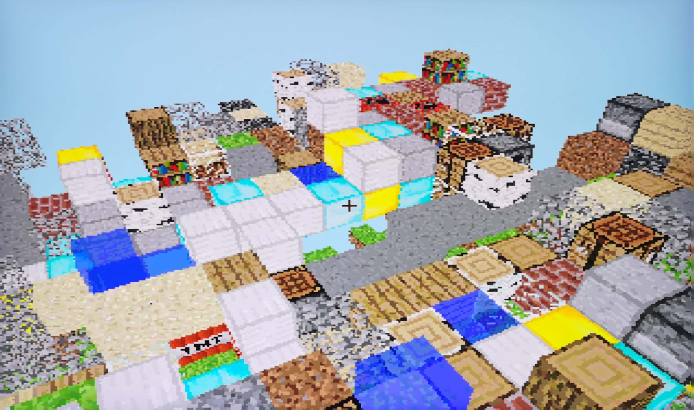</div>

### Inspiration
VHDL, as a hardware description language, is well-suited for handling computationally intensive parallel problems, which aligns perfectly with the requirements of three-dimensional rendering applications.

### Related Work
After conducting a preliminary search, it was found that there are few projects directly implementing 3D rendering on FPGA. Furthermore, those projects that do exist are relatively simple and may encounter performance issues. Some projects have achieved true rasterization rendering; however, they are not open-source, and the specific implementation details remain unclear. Here are a few typical related projects listed below:

1. [3D Game Prototype on an FPGA](https://www.youtube.com/watch?v=5LNa3Jv2uXE), a pseudo 3d game demo, not a real 3D engine.
<div align="center">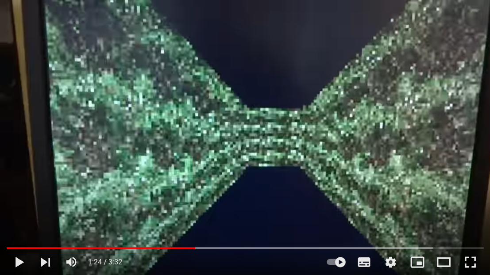</div>

2. [首次在FPGA上实现3D填色图像生成](https://www.bilibili.com/video/BV1S7411B79h), a mesh renderer, and is not open-sourced.
<div align="center">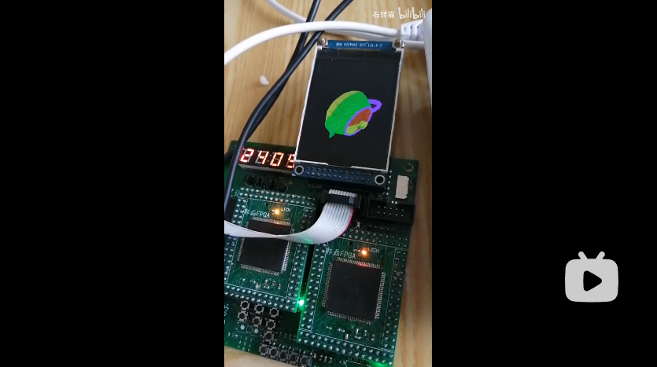</div>

3. [FPGA and ARM based 3D solid mesh renderer](https://www.youtube.com/watch?v=qO_uCHN8zQM), a solid mesh renderer, but seems to be not in pure hardware implementation (with ARM cores).
<div align="center">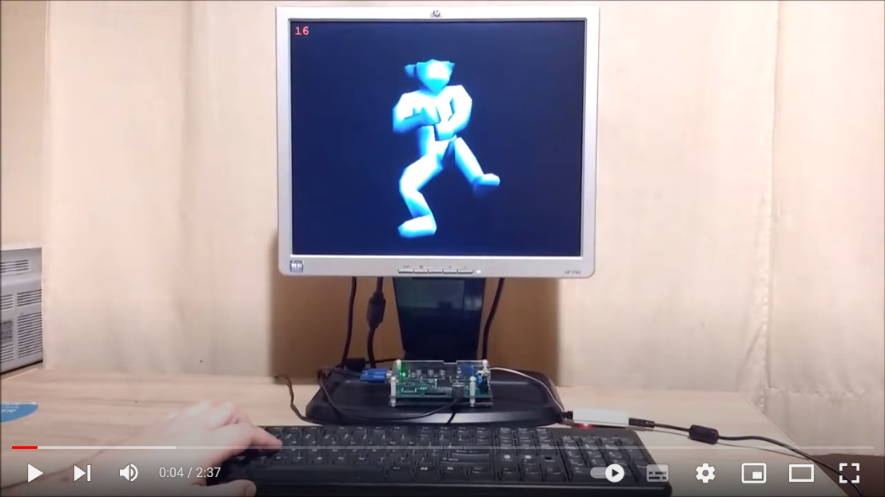</div>

4. [3D engine on FPGA home made](https://www.youtube.com/watch?v=jDzPfAbHLFI), a nice 3D engine.
<div align="center">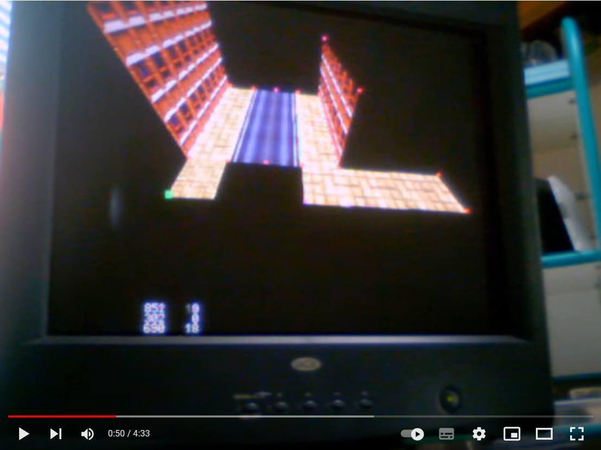</div>

5. [nickmqb/fpga_craft](https://github.com/nickmqb/fpga_craft), a very wonderful and open-sourced Minecraft clone, but is implemented in the author's own HDL, and is a entire system including CPU and GPU, which can not be taken as our reference.
<div align="center">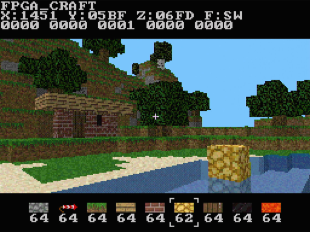</div>

6. *...... (more examples are omitted)*

According to the course requirements, we aim to construct the project using pure HDL (Hardware Description Language). In order to ensure the completeness of the project, we also desire to have a comprehensive scene and a user interface for interaction, rather than just a test program that lacks the essence of a game. Therefore, we have ultimately chosen to utilize VHDL to build a game resembling the classic sandbox game **Minecraft** on FPGA.

> It is worth noticing that **we did not reference or draw inspiration from any open-source repositories**, and we solely relied on the knowledge taught in the classroom for development. We independently contemplated and wrote every single detail.

### Features
We have implemented the following **features**:
1. Storage and rendering mapping for `24` types of blocks and `32` types of textures.
2. Free movement and perspective adjustment for the player character, with adjustable spherical field of view.
3. Block switching, placement, and destruction.
4. Scene rendering and sky background color.
5. Alpha blending for transparent objects.
6. Control using a PS2 controller and VGA output.
7. *...... (more features are omitted)*

### Key Issues
During the development process, several key issues were encountered. We briefly describe the solutions below, with detailed explanations provided in the subsequent sections:
1. Cross-clock domain issue between the VGA display module and rendering module (**Solution**: implementing dual-buffered frame memory).
2. Enhancing rendering frame rate (**Solution**: designing a multi-level pipelined architecture).
3. Managing RAM access among various modules (**Solution**: employing pipeline operations and prioritizing on-demand configuration read/write).
4. Handling floating-point calculations in the rendering computation (**Solution**: adopting fixed-point arithmetic approach and performing all calculations using integer operations).
5. Reducing resource consumption (**Solution**: employing pipeline design and globally reducing the number of integer signal bits).
6. *...... (more issues are omitted)*

### Development Environment and Toolchains
We utilized `Vivado 2022.2` on `Ubuntu 20.04` as the synthesis and implementation tool, along with `ghdl`, `ModelSim`, and the built-in tools of `Vivado` for simulation. Our primary development language was `VHDL 2008` (excluding the `Verilog` part in clock IP cores and some other where).

## Overview
### System Architecture
First, let's present the overall structure of the system. Due to its complexity, a more abstract block diagram is used for illustration. This diagram represents the RTL (Register Transfer Level) block diagram of the system, but it may not necessarily match the module divisions in the code. The code modules are further broken down into smaller components. Here is the diagram:
<div align="center">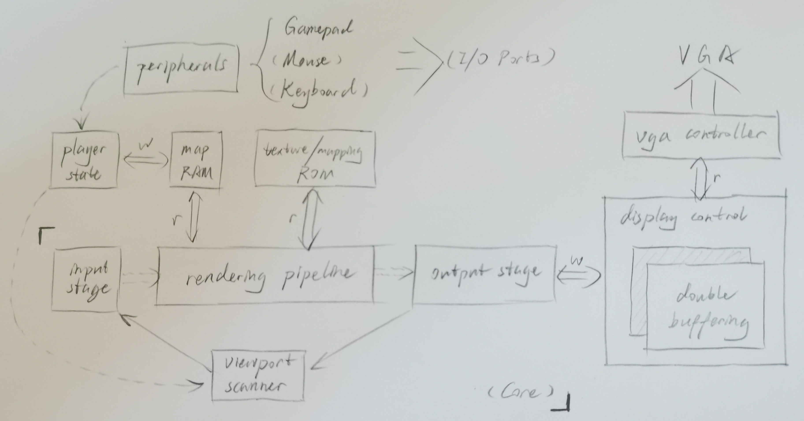</div>

From the diagram, several important components can be identified. Here's a brief introduction to them, with detailed explanations provided in the following sections:
1. First, we have the **Rendering Pipeline** and its associated input/output processing structures. It is primarily responsible for performing high-speed collision detection between the line of sight and objects, as well as conducting color calculations for rendering.
2. Above that, we have the **Player State Manager** and its associated circuits. It is responsible for storing the player's position, perspective, currently selected items, and other states. It receives input from input devices, provides player information to external components, and handles player interactions with the map, such as block destruction and placement.
3. On the right side, we have the graphics display section, centered around the **Display Control** module. It receives color calculation outputs from the pipeline and provides the desired color values to the VGA Controller. The dual-buffered structure and cache swapping operations ensure isolation of RAM read/write operations to prevent conflicts.
4. Other scattered **RAM and ROM modules** are used to store map data, textures, block information, and texture mappings. They are connected to other modules as needed, eliminating the need for further elaboration.

### I/O Ports
Regarding the I/O Ports of the Top Module, it mainly consists of the following:
1. A 100MHz clock input, labeled as `clk_sys`.
2. A reset signal, labeled as `rst`.
3. Button inputs for front, back, left, right, up, and down, denoted as `btn_{front/back/left/right/up/down}_in` (unused when switching to controller input).
4. SPI communication lines for the gamepad, including `spi_cs` (chip select), `spi_clk` (clock), `spi_mosi` (master output, slave input), and `spi_miso` (master input, slave output).
5. A VGA output structure, represented by the structure `vgaout`.
6. Debug outputs for a seven-segment display, including `anodes_n` (anode control) and `segs_n` (segment control).

## Architecture
Below, we will provide detailed explanations for each of the components mentioned earlier in the introduction, including the principles, timing requirements, and design of each component.

### Rendering Pipeline
#### Pipeline
As mentioned earlier, the main functions of the Rendering Pipeline are to **calculate the path of ray traversal** and **compute color values**.

> Before delving into the detailed explanation, it is necessary to provide a brief introduction to the **ray marching algorithm** used in this project for rendering.
>
> To render a three-dimensional scene on a two-dimensional plane, a common approach is to assume a point where the viewer's eye is located and connect the eye to each pixel on the screen with a ray called a "ray". Clearly, for each ray emitted from a pixel, the color of the object it intersects as it travels backward is the color that should be displayed at that point on the screen, which is known as simple perspective projection. This involves calculating the intersection of each ray with various objects in the scene. Implementing this using traditional rasterization methods can be complex in terms of hardware implementation.
>
> Taking into consideration the characteristics of the Minecraft game, where the scene is composed of **blocks** and each face is parallel to the coordinate axes, and the rays pass through a certain number of blocks during their traversal, it becomes simpler and more straightforward compared to calculating each face separately. Therefore, we employ the so-called "ray marching" algorithm. Each ray starts from the block where the viewer's eye is located, and at each step, we only need to calculate which direction (x, y, or z) the ray will intersect with a block face first based on its current direction. This allows us to determine which block the ray enters after passing through the current block. Additionally, if a block is not an air block, we can obtain the coordinates of the hit point and perform texture mapping to calculate the corresponding color value, thereby concluding the propagation of that ray. Take the situation in 2-D space as an example:
> <div align="center">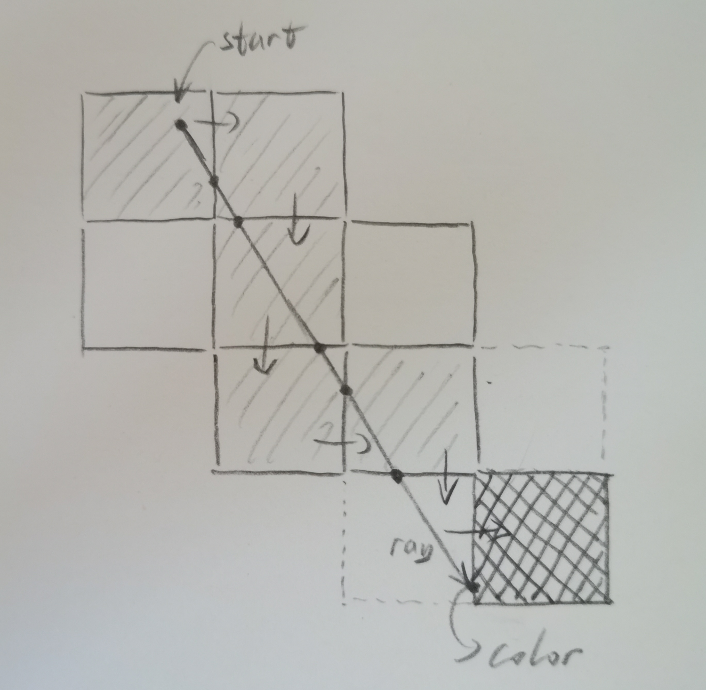</div>
>
> Following this approach, we can add support for **transparent blocks**. We keep track of the alpha channel of the ray's color and blend it with each block it passes through until the accumulated opacity reaches 100%, at which point we stop the propagation of that ray. If the ray reaches a block beyond the set view distance, we blend it with the color of the sky to obtain the final color and stop the propagation of the ray. Here's an example of a ray passing through a water block:
> <div align="center">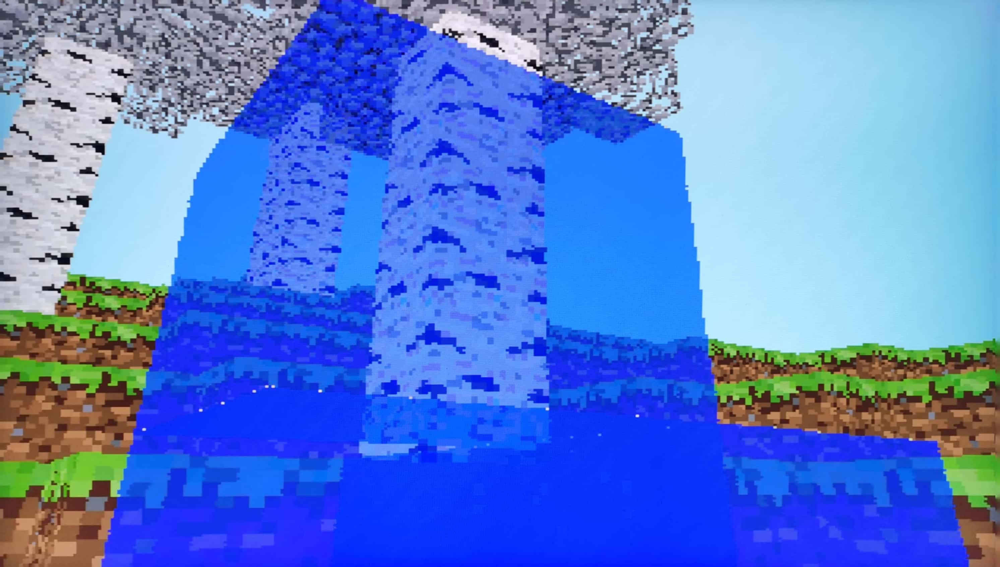</div>
> 
> It can be observed that the parts passing through the water are blended with the appropriate color of the water. Please ignore the color overlapping when passing through multiple transparent blocks, as this can be addressed by adding pipeline registers and some simple conditional logic.
> 
> It is worth emphasizing that although the circuit design on the board can only display 12-bit color values, for the sake of computational accuracy, especially in transparent blending, we utilize **four-channel 32-bit RGBA true-color representation** in both the computation process and texture storage. Finally, the color is downsampled to 12 bits.

Given the known information, this computation is actually **a large combinatorial logic block**. This means that we can **break it down into multiple stages of a pipeline** to significantly improve rendering speed with high throughput. Analyzing this process, we find that the computation for each block is the same:
1. Calculating the blending result of the color value at the intersection point of the ray with the block and the accumulated color value of the ray.
2. Determining which block the ray will enter next after passing through the current block.

So here is the pipeline structure we designed:
<div align="center">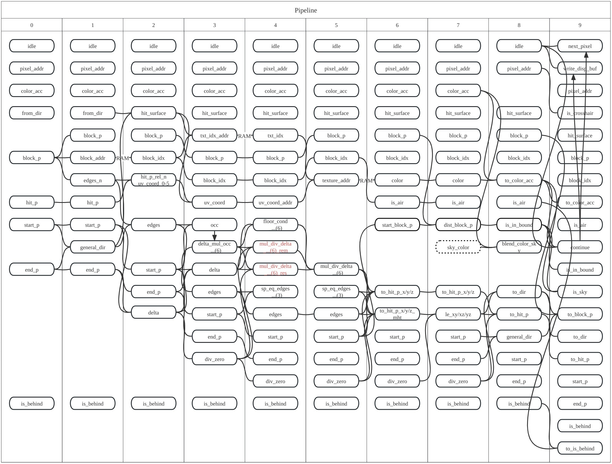</div>

Excluding the output stage (writing to the display buffer) and the post-processing stage (highlighting selected blocks, gamma correction, etc.), the pipeline consists of a total of `10` stages. Each stage strives to include a minimal number of multiplication and addition operations to ensure a high achievable frequency. The performance bottleneck primarily lies in the 4th stage, which involves division operations. In this case, we utilize the division IP core provided by Vivado, which offers fast computation speed. The entire pipeline can still operate reliably at a clock frequency of `50MHz`.

In practice, all operations involved in this pipeline are integer-based. Thus, **division can also be implemented using a pipeline structure** that includes shifting, multiplication, and other operations to further increase the upper limit of the frame rate. However, due to the added complexity, it was not implemented in this project.

> The code is too long to be included here (1000+ lines) and is simply a pipeline structure. Please refer to the diagram above and the source code for details.

#### Pipeline Input Stage
The above constitutes the main components of the rendering pipeline. Next, we need to consider **how the data to be fed into the pipeline is generated**.

As mentioned above, each stage of the pipeline processes information about the block through which a particular ray passes. Consequently, the pipeline has two types of inputs:
1. If the output color from the final stage of the pipeline still has transparency, it means that **the ray should continue advancing**. In this case, the input for the next clock cycle of the pipeline should be the information about the next block that the ray will encounter, which is calculated based on the output block of the final stage.
2. If the output color value from the final stage of the pipeline is fully calculated or if the ray extends beyond the viewing range and intersects with the sky, it means that **a new ray should be processed**. In this case, the input for the next clock cycle of the pipeline should be the starting point of a new ray, which is generated by the Viewport Scanner module. This initiates the calculation process for a new pixel on the screen.

>The process continues in this manner until all the rays emitted from every pixel on the screen have been computed. At this point, another control circuit takes over. When the current frame's VGA scan is complete, a **buffer swap operation** is performed. The newly calculated image is handed over for display on the screen, while the computation of the next frame begins, writing it into the old buffer.

The `viewport_scanner` module is like:
```vhdl {.line-numbers}
entity viewport_scanner is
    port (
        clk_ppl, rst, enable: in std_logic;
        fragment_uv: out vec2i_t
    );
end entity;
```
where the `enable` signal will be asserted in the second case mentioned above, and the `fragment_uv` signal will be used to calculate the initial information of the ray. These are all controlled by `pipeline_entrance.vhd`, which accepts the outputs of the pipeline as inputs and generates the inputs for the next clock cycle of the pipeline:
```vhdl {.line-numbers}
entity pipeline_entrance is
    port (
        clk_ppl, rst, enable: in std_logic;
        p_pos: in vec3i_t;
        p_angle: in vec2i_t;
        is_preparing, is_eof: out std_logic;
        towards_h: out vec2i_t;
        -- Pipeline Final States
        next_pixel_pplout: in std_logic;
        pixel_addr_pplout: in std_logic_vector(DISP_RAM_ADDR_RADIX - 1 downto 0);
        to_color_acc_pplout: in color_t;
        to_block_p_pplout: in vec3i_t;
        to_dir_pplout: in dir_t;
        to_hit_p_pplout: in vec3i_t;
        start_p_pplout: in vec3i_t;
        end_p_pplout: in vec3i_t;
        to_is_behind_pplout: in std_logic;
        -- Pipeline Entrances
        idle: out std_logic;
        pixel_addr: out std_logic_vector(DISP_RAM_ADDR_RADIX - 1 downto 0);
        color_acc: out color_t;
        from_dir: out dir_t;
        block_p: out vec3i_t;
        hit_p: out vec3i_t;
        start_p: out vec3i_t;
        end_p: out vec3i_t;
        is_behind: out std_logic
    );
end entity;
```

It is worth noting that the `pipeline_entrance.vhd` module also includes a state machine that controls the pipeline's operation.

This state machine is used to control the operation of the pipeline and addresses two main issues:
1. After the completion of frame calculation, the character's position is updated, and the process of calculating the starting and ending points of light rays using the character's pose and pixel screen coordinates may have a higher latency than each stage in the pipeline. This may require a few cycles of pause before starting the calculation for each frame (subsequent testing revealed that the latency seems to be within an acceptable range).
2. Waiting until the end of displaying one frame and then restarting after swapping the buffer.

> Please refer to the source code for details.

#### Pipeline Output Stage
The output signals of the pipeline flow in two directions. Firstly, as mentioned before, they interact with the display buffer, controlling the writing of data into the buffer and initiating swap requests. Secondly, they enter another post-processing pipeline, where various post-processing operations on the image are performed.

The former will not be elaborated upon here, while the latter, in the pipeline, mainly performs the following operations:
1. Determines if a pixel belongs to the surface selected by the cursor and applies a highlight effect if true.
2. Determines if a pixel is on the crosshair cursor displayed on the screen and applies a reverse color effect if true.

Like this (in `top_module.vhd`):
```vhdl {.line-numbers}
-- Post-tracing pipeline
process (clk_ppl, rst) is
begin
    if rst = '1' then
        color_pass_1 <= (others => 0);
        color_pass_2 <= (others => 0);
        write_enable_1 <= '0';
        write_enable_2 <= '0';
        write_addr_1 <= (others => '0');
        write_addr_2 <= (others => '0');
    elsif rising_edge(clk_ppl) and bake_ppl_enable = '1' then
        color_pass_1 <= color_pass_1_next;
        color_pass_2 <= color_pass_2_next;
        write_enable_1 <= write_enable_1_next;
        write_enable_2 <= write_enable_2_next;
        write_addr_1 <= write_addr_1_next;
        write_addr_2 <= write_addr_2_next;
    end if;
end process;
bake_ppl_enable <= pipeline_enable;

-- Stage 0
color_pass_0 <= to_color_acc_out;
write_enable_0 <= '1' when write_disp_buf_out = '1' and pipeline_enable = '1' else '0';
write_addr_0 <= pixel_addr_out;

-- Stage 1: select mask
color_pass_1_next <=
    color_pass_0 when valid_sel = '0' or block_p_out /= block_p_sel or hit_surface_out /= hit_surface_sel else
    color_pass_0 * 120 / 255 + color_t'(1, 1, 1, 1) * 125;
write_enable_1_next <= write_enable_0;
write_addr_1_next <= write_addr_0;

-- Stage 2: crosshair inverse
color_pass_2_next <=
    color_t'(255, 255, 255, 255) - color_pass_1 when
        (write_addr_1 >= CENTER_ADDR - 3 and write_addr_1 <= CENTER_ADDR + 3) or
        (write_addr_1 = CENTER_ADDR - 3 * H_REAL) or
        (write_addr_1 = CENTER_ADDR - 2 * H_REAL) or
        (write_addr_1 = CENTER_ADDR - 1 * H_REAL) or
        (write_addr_1 = CENTER_ADDR + 1 * H_REAL) or
        (write_addr_1 = CENTER_ADDR + 2 * H_REAL) or
        (write_addr_1 = CENTER_ADDR + 3 * H_REAL)
    else color_pass_1;
write_enable_2_next <= write_enable_1;
write_addr_2_next <= write_addr_1;

-- Output Stage
color_baked <= color_pass_2;
write_enable_baked <= write_enable_2;
write_addr_baked <= write_addr_2;
```
and eventually, the "baked" color will be written to the display buffer:
```vhdl {.line-numbers}
disp_buf_write_enable <= write_enable_baked;
disp_buf_write_addr <= write_addr_baked;
disp_buf_write_data <= std_logic_vector(to_unsigned(color_baked.r / 16, 4)) & std_logic_vector(to_unsigned(color_baked.g / 16, 4)) & std_logic_vector(to_unsigned(color_baked.b / 16, 4));
```

### Display Control
The display control consists of two main parts: the VGA output controller, which generates the synchronization signal timing required for the `VGA` protocol, and the display buffer management, also known as the double-buffering structure mentioned earlier, which facilitates read/write separation to prevent conflicts and frame misalignment. For example, the diagram below shows the output of an older version during the development process. It does not utilize the double-buffering structure, resulting in periodic stripes caused by read/write conflicts. Additionally, a misalignment of two frames can be observed in the middle section of the screen:
<div align="center">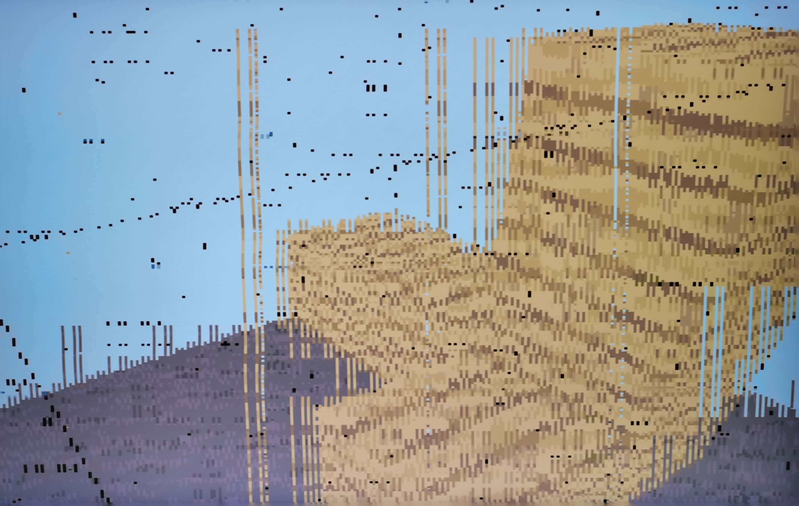</div>

The implementation of the double-buffering structure is straightforward. For convenience, we use on-chip BRAM as the RAM storage, which is theoretically the fastest RAM resource for read and write operations. We instantiate two identical RAM blocks that match the resolution (set to `320x240`) and add control logic to keep track of the current state (which buffer is the front buffer). By utilizing this state, we control a multiplexer to route the inputs and outputs of the module to the corresponding RAM ports. Additionally, a synchronous input signal called `swap_sync` is included to indicate the swapping of buffers. Once encapsulated in this manner, the entire module can be used as a single RAM. The timing and reasons for swapping buffers have been discussed in the previous analysis and will not be reiterated here. The following is a simplified structural diagram intended for conceptual representation, without full elaboration:
<div align="center">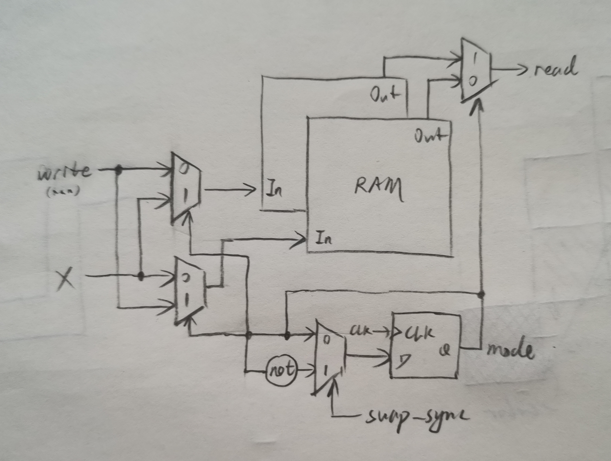</div>

The VHDL implementation is as follows and other details are omitted:
```vhdl {.line-numbers}
architecture Behavioral of display_buffers is
    ...
begin
    disp_ram_0: display_ram ...
    
    disp_ram_1: display_ram ...

    clka_0 <= '0'               when mode = '0' else clk_write;
    ena_0 <= '0'                when mode = '0' else en_write;
    wea_0 <= "0"                when mode = '0' else we_write;
    addra_0 <= (others => '0')  when mode = '0' else addr_write;
    dina_0 <= (others => '0')   when mode = '0' else din_write;
    clkb_0 <= clk_read          when mode = '0' else '0';
    enb_0 <= en_read            when mode = '0' else '0';
    addrb_0 <= addr_read        when mode = '0' else (others => '0');

    clka_1 <= clk_write         when mode = '0' else '0';
    ena_1 <= en_write           when mode = '0' else '0';
    wea_1 <= we_write           when mode = '0' else "0";
    addra_1 <= addr_write       when mode = '0' else (others => '0');
    dina_1 <= din_write         when mode = '0' else (others => '0');
    clkb_1 <= '0'               when mode = '0' else clk_read;
    enb_1 <= '0'                when mode = '0' else en_read;
    addrb_1 <= (others => '0')  when mode = '0' else addr_read;

    dout_read <= doutb_0        when mode = '0' else doutb_1;

    process (clk_ppl, rst) is
    begin
        if rst = '1' then
            mode <= '0';
        elsif rising_edge(clk_ppl) and enable = '1' then
            mode <= mode_next;
        end if;
    end process;
    mode_next <= not mode when swap_sync = '1' else mode;
end architecture;
```

### Player State Control
The module is responsible for updating the character's state and handling interactions between the character and the world. This includes the character's position, view direction, currently held items, currently selected surface of the block by the cursor, and so on. The reason for designing this module is that data inputs like buttons and joysticks are continuous processes, and we need to sample and maintain the inputs at a certain frequency to regulate the update rate of the character's state. Additionally, it helps prevent continuous triggering of buttons. Therefore, this module is essentially a collection of registers and state machines.

The I/O ports are as follows:
```vhdl {.line-numbers}
entity player_state_updater is
    port (
        clk, rst, enable: in std_logic;
        -- Manipulation
        left_click, right_click: in std_logic;
        block_p_sel, block_p_inc: in vec3i_t;
        mani_enable: out std_logic;
        block_p_target: out vec3i_t;
        idx_target: out int;
        -- Inventory
        last_item_click, next_item_click: in std_logic;
        current_item: out int;
        -- Movement
        move_lr_offset, move_fb_offset, move_ud_offset: in int;
        angle_lr_offset, angle_ud_offset: in int;
        towards_h: in vec2i_t;
        current_pos: out vec3i_t;
        current_angle: out vec2i_t
    );
end entity;
```
For more details please refer to the source code (in `player_state_update.vhd`). Specifically, the pose of the player will be only updated at the end of a frame's rendering.

### Input Peripherals
#### Gamepad
Due to various operations involved, including character movement, perspective changes, placing, breaking, item switching, and more, relying solely on the onboard buttons is highly inconvenient. The mouse can be conveniently used for perspective movement, and the keyboard can be utilized for other functions. However, there is only one `HID` to `PS/2` protocol chip on the board, connected to the sole `USB-TypeA` port, making it impossible to simultaneously use both the keyboard and mouse (without considering external adapter modules).

Therefore, we directly opted for the popular **PlayStation 2 gamepad**, which communicates via the SPI protocol. We utilized the wireless version and connected the receiver to the FPGA through an adapter board:
<div align="center">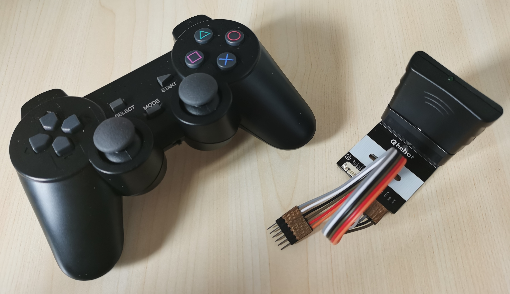</div>

The PS2 controller uses the `SPI` protocol to communicate, where in the red light mode, it sends `8` bytes of data to the master device with information about the device mode, start signal, button triggers, and four channels of analog joystick sample values. The `SPI` protocol used by the controller is falling edge triggered, and the button states are represented by low signals. The timing diagram is roughly as follows (the `MOSI` and `MISO` signals in the diagram are for illustration purposes and are not related to actual data):
<div align="center">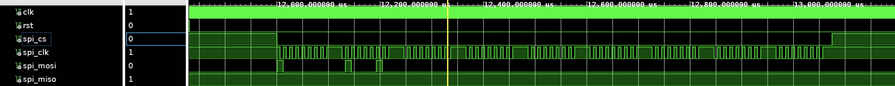</div>

We generate the timing using a state machine, running at twice the frequency of the SPI clock. It generates three output signals and captures the required information from the input signals. The VHDL code of the next logic for the driver is roughly as follows (check the source code `gamepad.vhd` for more details):
```vhdl {.line-numbers}
...
cs_next <=
    '1' when byte_cnt = 8 and bit_cnt = BYTE_TICKS - 1 else
    cs_reg;

clk_next <=
    '1' when cs_reg = '1' or bit_cnt > 7 else
    edge_next;

edge_next <= not edge;

byte_cnt_next <=
    byte_cnt when byte_cnt = 8 or edge = '1' or bit_cnt /= BYTE_TICKS - 1 else
    byte_cnt + 1;

bit_cnt_next <=
    bit_cnt when cs_reg = '1' or edge = '1' else
    0 when bit_cnt = BYTE_TICKS - 1 else
    bit_cnt + 1;

process (all) is
begin
    data_signals_next <= data_signals;
    if edge = '1' and byte_cnt >= 0 and byte_cnt <= 8 and bit_cnt >= 0 and bit_cnt < 8 then
        data_signals_next(byte_cnt)(bit_cnt) <= spi_miso;
    end if;
end process;
...
```

## Performance & Analysis
### Screenshots
As a game project, the running results are represented by actual in-game screenshots. Below are some showcased game screenshots:
<div align="center">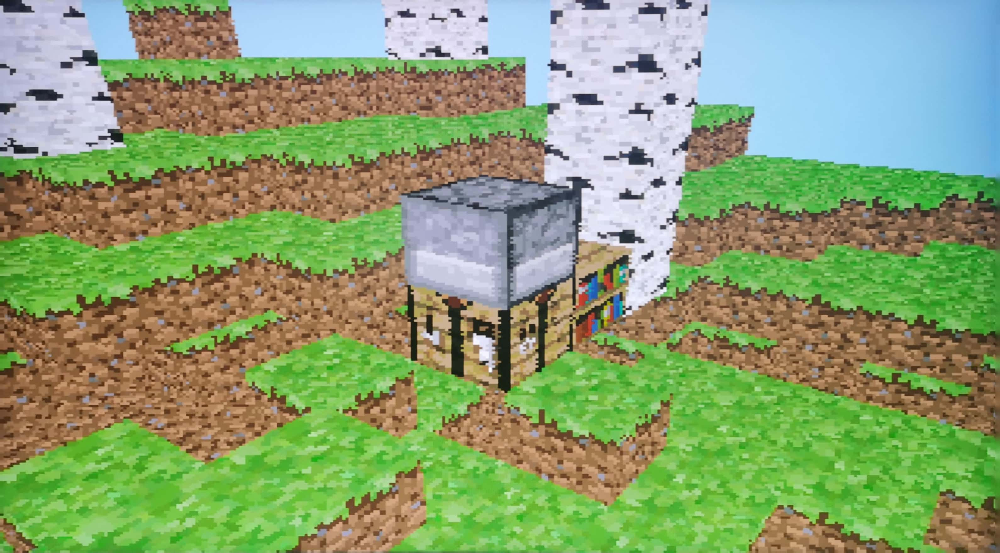</div>
<p></p>
<div align="center">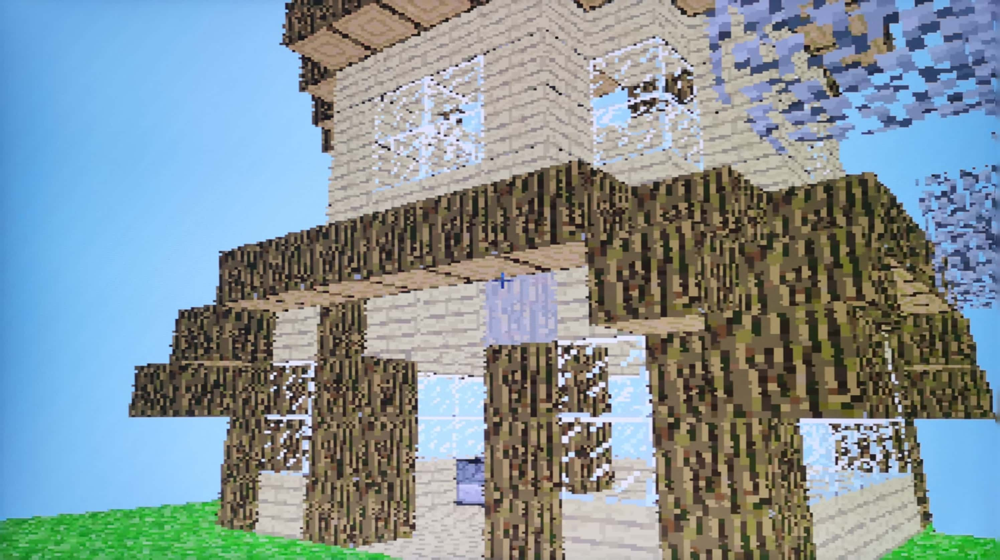</div>

### Specifications
#### Frames Per Second
During the writing process, the key issues we encountered can all be transformed into corresponding metrics. For instance, for this 3D rendering attempt, one of the most crucial metrics is the frame rate at which the game can run, i.e. **fps** (frames per second).

Based on the previous design approach, it is evident that the frame rate primarily depends on the screen resolution, the average number of blocks traversed per ray, and the clock frequency of the pipeline. In our design, the image quality requirements are relatively low, and to improve the frame rate, we have opted for a display resolution of `320x240`. The pipeline clock frequency can be set to `50MHz` and still function properly (higher frequencies have not been tested). The average number of blocks traversed by a ray, denoted as N, is strongly correlated with the character's perspective and the map conditions. From this information, an estimated frame rate can be obtained:

$$ fps = \frac{50000000}{320 \times 240 \times N} $$

With an initial set viewing distance of around twenty blocks and considering the redundancy during traversal, we can calculate that the frame rate ranges from a few tens to several hundreds for both ground-level and sky-view scenarios. In practical testing, the frame rate for a horizontal perspective ranges from `20` to `30` fps, while entering opaque blocks (with a constant step distance of `1`) yields a frame rate of around `520` fps. Looking towards the sky results in a frame rate of approximately `15` fps. These frame rates are already quite smooth, providing a comfortable gaming experience.

#### Resource Utilization
Due to the utilization of a pipeline structure, significant resource reuse has been achieved, resulting in acceptable resource consumption.

Using the xc7a100t chip, after multiple fine-tuning iterations, the approximate utilization is as follows: LUTs occupy around `30%`, BRAM occupies around `65%`, and DSP occupies around `30%`.

It is important to note that the utilization of various resources may vary depending on synthesis and implementation strategies.

#### Limitations
Firstly, as mentioned earlier, the maximum frequency of the pipeline is limited by **the speed of division operations**. However, this bottleneck can be optimized by breaking down the division into a pipelined structure.

Secondly, since the entire system utilizes integer arithmetic, there is a limitation on the **precision** of the rendered graphics. To improve computational precision, it would require increasing the number of bits in the synchronized integer signals, which would result in an increase in LUT utilization (still within an acceptable range). Using a complete 32-bit integer for computations resulted in an increase of approximately `10%` in LUT utilization.

Further limitations and details are not elaborated here.

## Project Information
### Tasks
The algorithm validation, rendering pipeline, and display control sections of this project were completed by **Wang**, while the peripheral controller drivers were handled by **Shu**. They also individually completed their respective sections of this report.

### Project Management
The project was managed using the **GitHub** platform. The repository can be found at [Gralerfics/FmcPGA](https://github.com/Gralerfics/FmcPGA).

### History
The project development started approximately from the time of the project proposal and underwent two major rewrites. The first version utilized floating-point numbers without a pipeline, leading to a significant oversaturation of LUT resources. In the second version, we implemented a multi-channel pipeline parallelism, but encountered unresolved timing issues with RAM read/write operations. The current version, referred to as the third version, is the final architecture redesigned within a span of two days. It adopts a single-channel pipeline, which aligns better with conventional design principles.

### Budget
The project was completed using the FPGA board provided by the course instructor and the gamepad owned by Wang. No additional budget was required.

## Conclusion and Future Work
In general, the attempt made in this project has been successful. **And this might be the only open-sourced FPGA-based 3D game developed purely using HDL language which can be found on Internet in recent years.**

Initially, the project proposal aimed to create pseudo 3D graphics similar to the first example in the Related Work section. However, through the course of our studies, we realized that a pipeline structure can be utilized to construct high-throughput sequential circuits, resolve timing issues, and reduce resource consumption. Consequently, we successfully completed a simple renderer for full-screen scanning.

Based on this accomplishment, we have gained a general approach for developing similar projects. Here are a few new ideas for future implementations:
1. For this project, we can incorporate features such as lighting calculations and collision detection on the surfaces of the blocks.
2. For similar projects, we can develop a universal FPGA game development framework that integrates commonly used input/output devices and core logic controllers based on a pipeline design.
3. In terms of graphics rendering, this project only created a renderer capable of rendering blocks using Minecraft-like features. In the future, we can explore creating a more generic renderer or leverage computer architecture knowledge to develop a GPU, among other possibilities.

That's all of our work. Thank you for reading.
