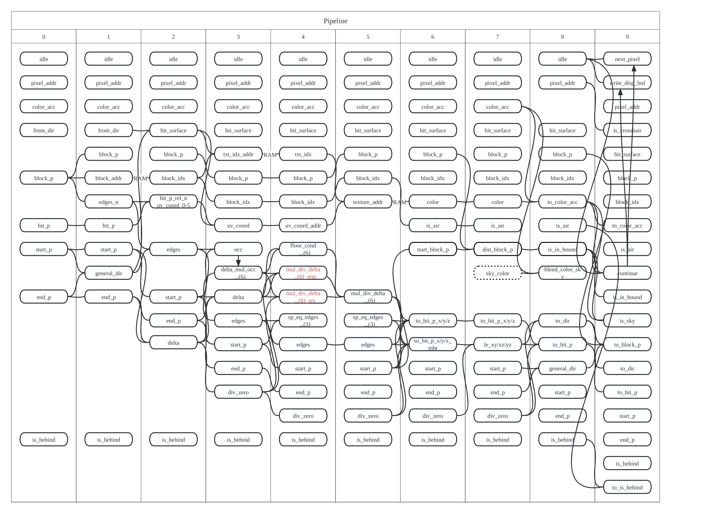

# FmcPGA

Also the final project for SUSTech EE332-Digital-System-Designing.

A pseudo Minecraft game running on Artix-7 FPGA using VHDL.

## Screenshots

    
    
    

## The board

    

## Bugs remained to be fixed

There is something wrong with the alpha channel (water).

    

